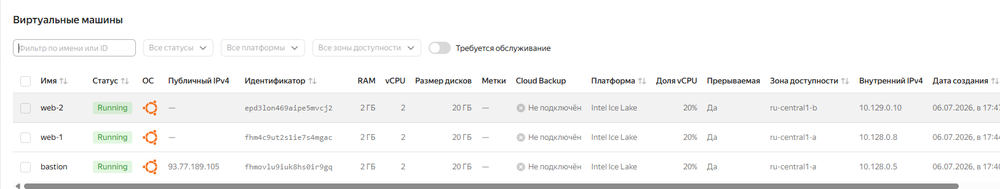
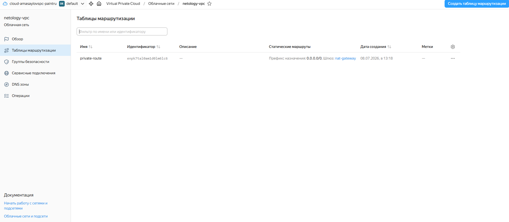
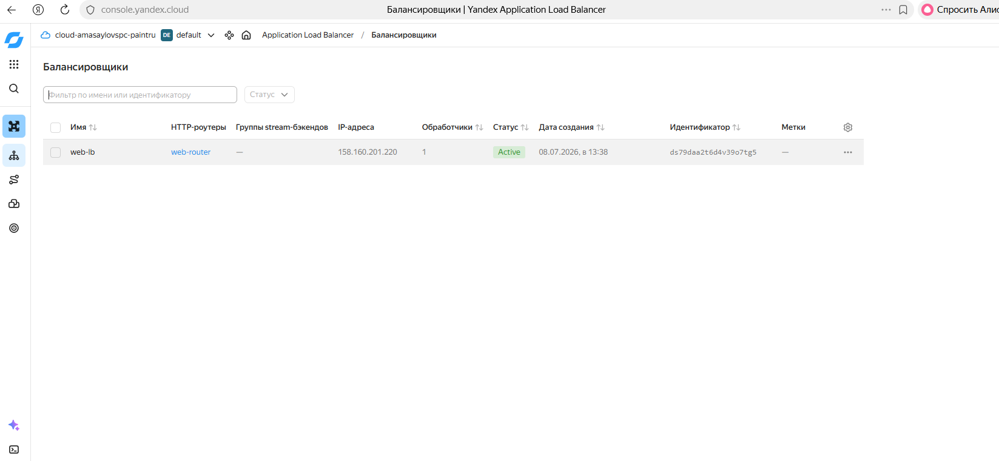
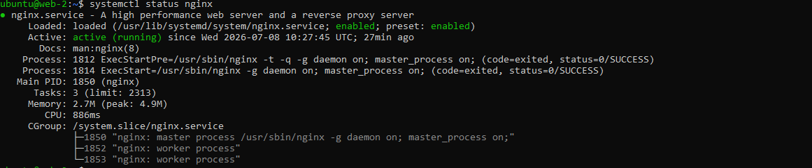
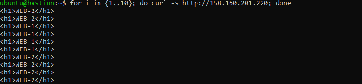

# Дипломная работа по профессии «Системный администратор»

## Выполненные этапы

### 1. Сайт

Выполнено:

- создан bastion-хост для SSH-доступа к серверам внутренней сети;
- созданы два веб-сервера `web-1` и `web-2` в разных зонах доступности;
- настроен NAT Gateway и таблица маршрутизации `private-route` для приватных подсетей;
- установлен и запущен Nginx на обоих веб-серверах;
- создан и настроен L7 Application Load Balancer;
- настроены Target Group, Backend Group и HTTP Router;
- выполнена проверка работы балансировщика.

### Проверка

```bash
curl http://158.160.201.220
```

Балансировщик успешно распределяет запросы между серверами `web-1` и `web-2`.

### Скриншоты

#### Виртуальные машины



#### NAT Gateway



#### Балансировщик



#### WEB-1


#### WEB-2



#### Проверка curl


#### Проверка балансировки


