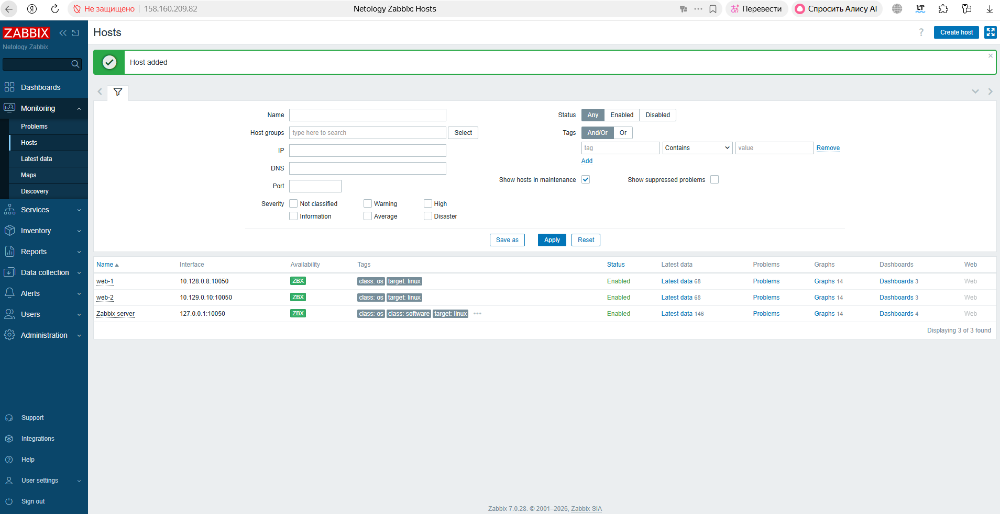
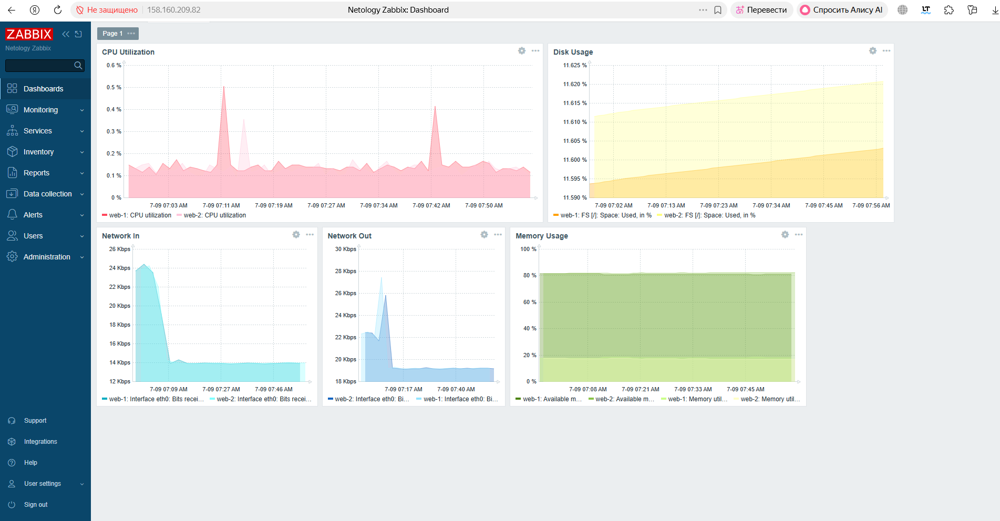
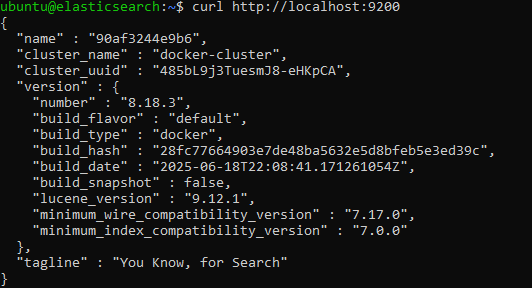
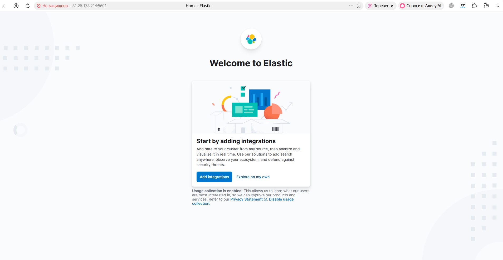
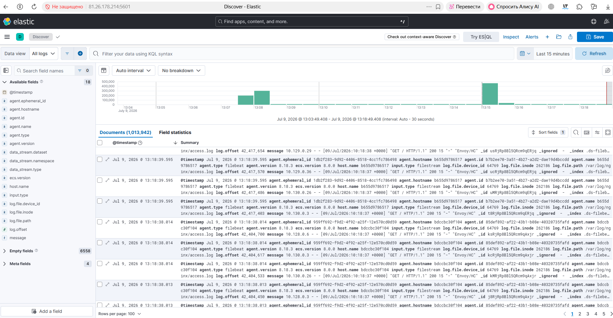
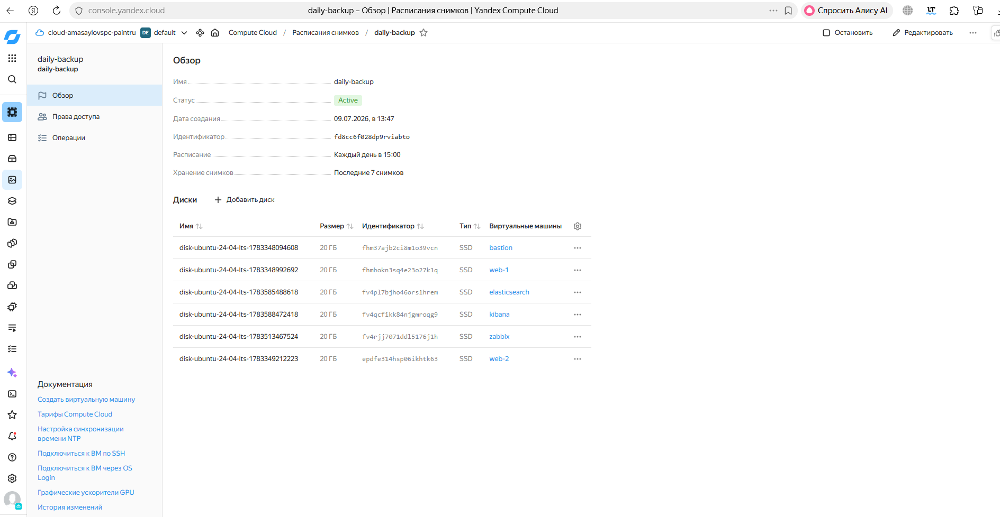

# Дипломная работа по профессии «Системный администратор»

## Выполнение дипломной работы

### 1. Сайт

Выполнено:

- создан bastion-хост для SSH-доступа к серверам внутренней сети;
- созданы два веб-сервера `web-1` и `web-2` в разных зонах доступности;
- настроен NAT Gateway и таблица маршрутизации `private-route` для приватных подсетей;
- установлен и запущен Nginx на обоих веб-серверах;
- создан и настроен L7 Application Load Balancer;
- настроены Target Group, Backend Group и HTTP Router;
- выполнена проверка работы балансировщика.

### Проверка

```bash
curl http://158.160.201.220
```

Балансировщик успешно распределяет запросы между серверами `web-1` и `web-2`.

### Скриншоты

#### Виртуальные машины


#### NAT Gateway


#### Балансировщик


#### WEB-1


#### WEB-2


#### Проверка curl


#### Проверка балансировки


## 2. Мониторинг

В рамках выполнения дипломной работы развернут сервер мониторинга Zabbix 7.0.

На серверах `web-1` и `web-2` установлен и настроен `Zabbix Agent 2`. После подключения агенты успешно зарегистрированы на сервере Zabbix и находятся в состоянии **Available (ZBX)**.

Создан Dashboard для мониторинга основных показателей серверов.

На панели мониторинга отображаются:

- загрузка процессора (CPU);
- использование оперативной памяти (RAM);
- использование дискового пространства;
- входящий сетевой трафик;
- исходящий сетевой трафик.

### Скриншоты

#### Подключенные хосты



#### Dashboard



## 3. Сбор логов

Выполнено:

- развернут Elasticsearch 8.18 в Docker;
- развернута Kibana 8.18 в Docker;
- на web-1 и web-2 установлен Filebeat;
- настроена отправка access.log и error.log Nginx в Elasticsearch;
- в Kibana успешно отображаются логи обоих веб-серверов.

### Скриншоты

#### Elasticsearch



#### Kibana



#### Логи в Discover



## 4. Резервное копирование

Выполнено:

- создано расписание ежедневного резервного копирования;
- в расписание добавлены все виртуальные машины;
- хранится 7 последних снимков.

### Скриншоты

#### Расписание резервного копирования

