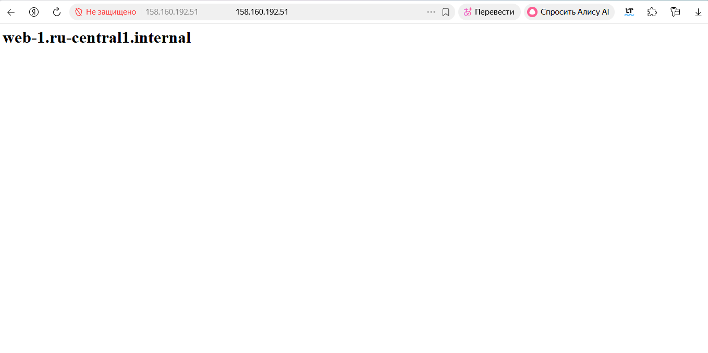
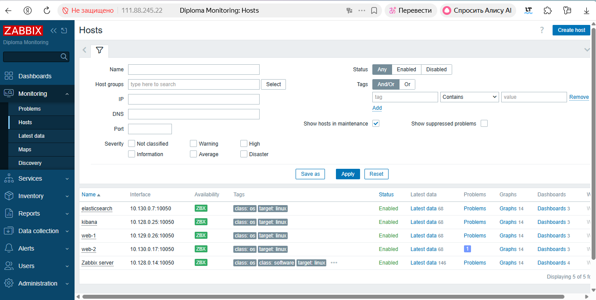
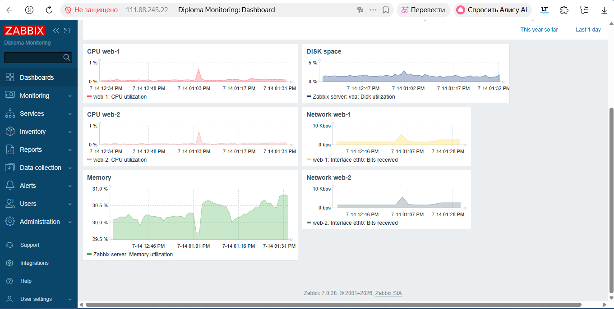
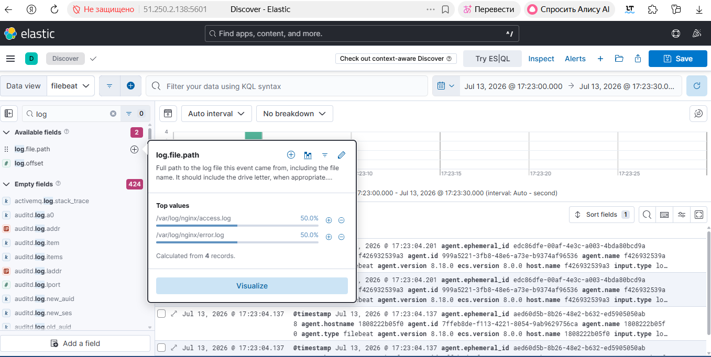
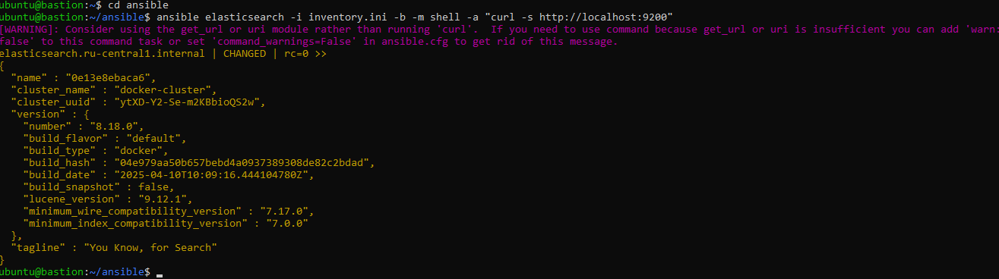
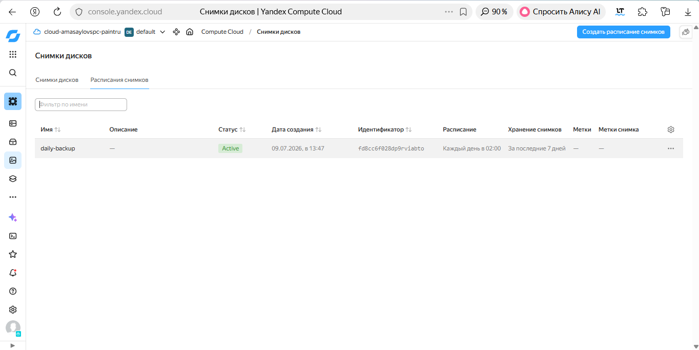
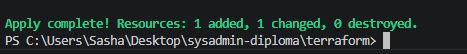
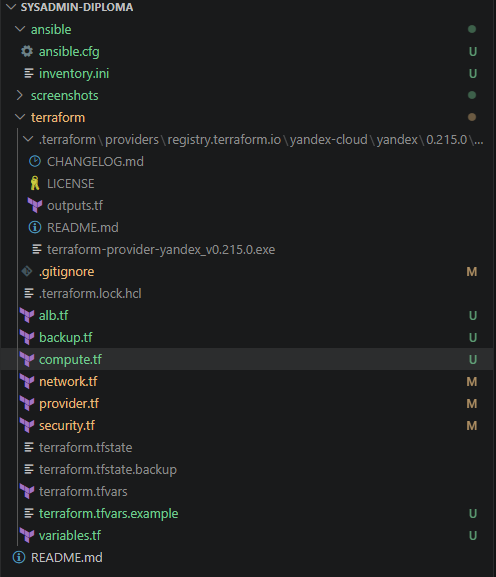
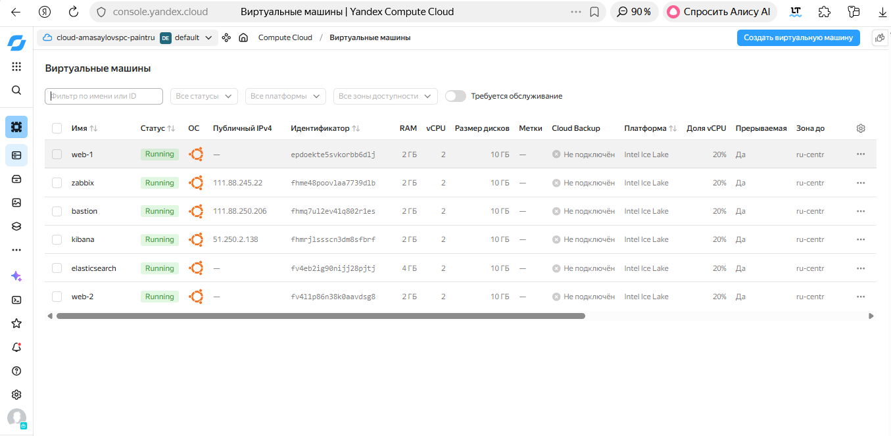
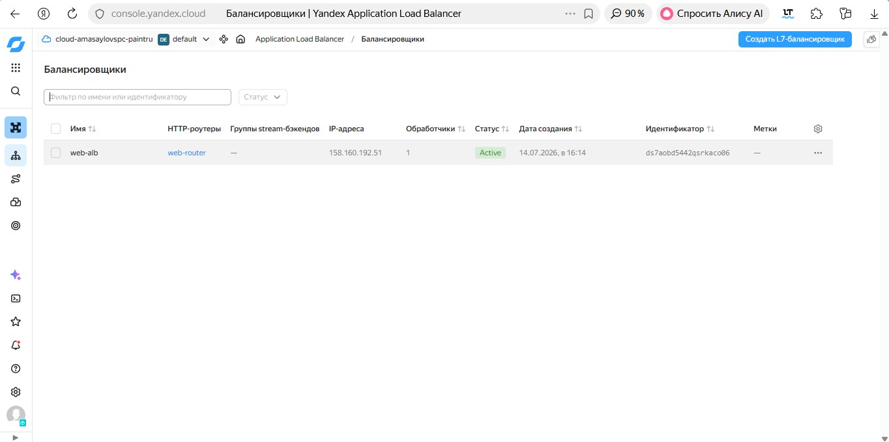

# Дипломная работа по профессии «Системный администратор»

## Описание проекта

Разработана отказоустойчивая инфраструктура для веб-приложения в Yandex Cloud с использованием Terraform и Ansible.

Инфраструктура включает:

- Terraform
- Ansible
- Bastion Host
- Nginx
- Application Load Balancer
- Zabbix
- Elasticsearch
- Kibana
- Filebeat
- Snapshot Backup

---

# Используемые технологии

- Yandex Cloud
- Terraform
- Ansible
- Ubuntu 22.04
- Docker
- Nginx
- Zabbix 7
- Elasticsearch 8
- Kibana 8
- Filebeat

---

# Структура инфраструктуры

```
Internet
     │
Application Load Balancer
     │
 ┌──────┴──────┐
 │             │
web-1       web-2
 │             │
 └──────┬──────┘
        │
 Elasticsearch
        │
     Kibana

Bastion Host

Zabbix Server
```

---

# Виртуальные машины

| ВМ | Назначение |
|-----|------------|
| bastion | SSH-доступ к приватным ВМ |
| web-1 | Nginx |
| web-2 | Nginx |
| elasticsearch | Хранение логов |
| kibana | Просмотр логов |
| zabbix | Мониторинг |

---

# Terraform

Конфигурация разбита на отдельные файлы:

```
terraform/

provider.tf
network.tf
compute.tf
security.tf
alb.tf
backup.tf
variables.tf
outputs.tf
```

---

# Ansible

Используются отдельные playbook:

```
ansible/

inventory.ini
ansible.cfg

nginx.yml
docker.yml
zabbix.yml
elastic-docker.yml
kibana-docker.yml
filebeat.yml
```

---

# Проверка работы сайта

Сайт доступен через Application Load Balancer.

## Скриншот



---

# Мониторинг

Все серверы подключены к Zabbix Agent.

## Hosts



## Dashboard



---

# Логирование

Используется Filebeat.

Логи nginx передаются в Elasticsearch.

Просмотр осуществляется через Kibana.

## Kibana



## Elasticsearch



---

# Snapshot Backup

Настроено ежедневное резервное копирование всех виртуальных машин.

Срок хранения:

- 7 дней

## Snapshot Schedule



---

# Terraform Apply

Последнее успешное применение конфигурации.



---

# Структура проекта



---

# Виртуальные машины



---

# Load Balancer




---

# Итог

В ходе выполнения дипломной работы была создана отказоустойчивая инфраструктура в Yandex Cloud.

Реализованы:

- Terraform-развертывание инфраструктуры
- Настройка сети и Security Groups
- Bastion Host
- Два Web-сервера
- Application Load Balancer
- Мониторинг Zabbix
- Elasticsearch
- Kibana
- Filebeat
- Snapshot Backup